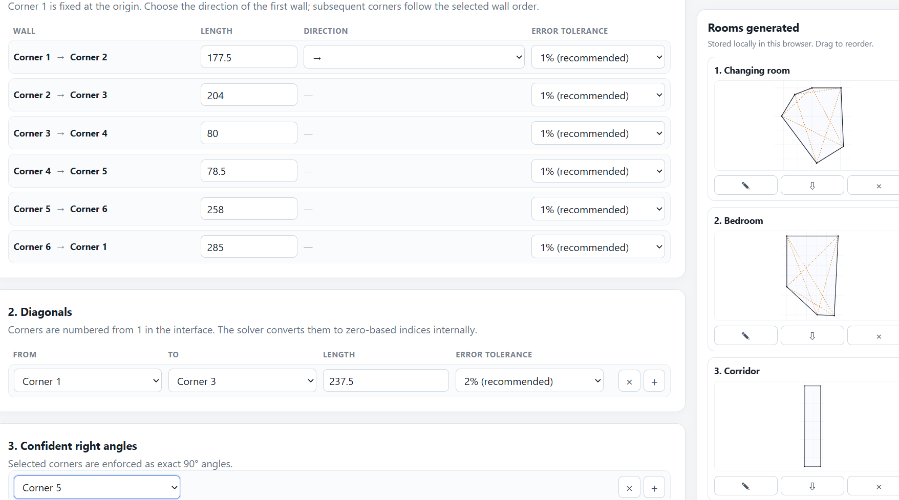
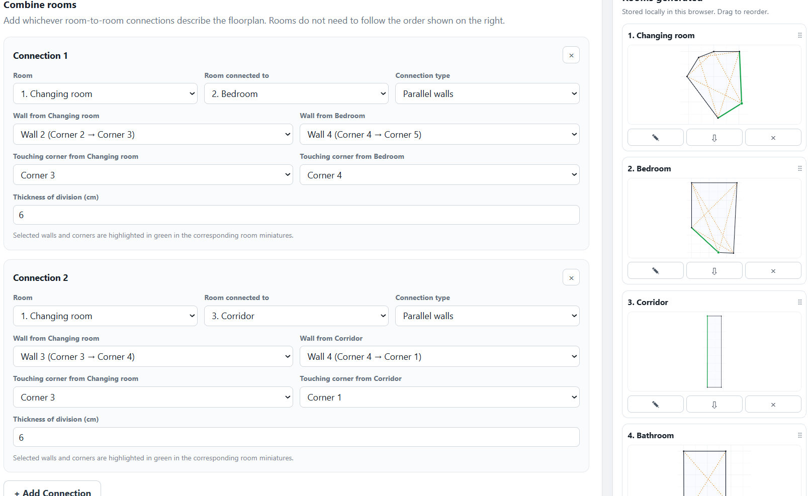
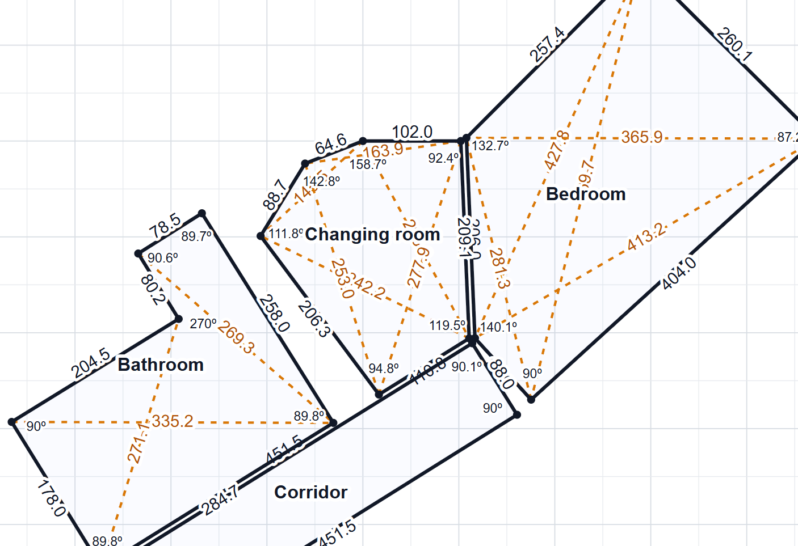

# Room Shape Reconstructor

Room Shape Reconstructor helps you rebuild the shape of a room from real-world measurements, even when the room is irregular and the measurements are not perfectly consistent.

It is particularly useful for rooms that are difficult to reproduce accurately with simple floor-planning tools:

- rooms with more than four walls;
- walls meeting at angles other than 90°;
- asymmetric or unusual layouts;
- spaces where only some corners are known to be right angles;
- measurements taken manually, where small errors are unavoidable;
- situations where diagonal measurements are available and can help determine the overall geometry.

Rather than assuming that every measurement is exact, the tool finds a **compatible room shape at scale** that stays within the measurement tolerances you provide.

> **Try the tool:** [Open Room Shape Reconstructor](https://ddiezalo.github.io/floorplan-maker/)

---

## What problem does it solve?

Measuring a real room rarely produces a perfectly consistent set of numbers.

A tape measure may bend slightly, a long diagonal may be difficult to position precisely, walls may not be perfectly straight, and two measurements taken from different points can disagree by a centimetre or two.

This becomes especially problematic for irregular rooms. If several wall lengths, diagonals and angles are entered as if they were all exact, there may be no geometrically possible shape that satisfies every measurement simultaneously.

Room Shape Reconstructor is designed for this situation.

You provide:

- the lengths of the walls;
- any diagonals you have measured;
- any corners you are confident are exactly 90°;
- an acceptable measurement tolerance for each distance.

The tool then searches for a geometrically compatible shape that respects the information you trust most while allowing small corrections to the measurements where necessary.

---

## How the estimation works

The method follows a simple hierarchy.

### Fixed information

The starting point and direction of the first wall establish the reference position of the room.

Any corner marked as a confident right angle is treated as exactly **90°**.

### Wall measurements

Wall lengths are treated as the most important measured distances.

Each wall has its own permitted error margin, expressed as a percentage of the measurement. A shorter wall can therefore be given a tighter tolerance than a long wall that may have been more difficult to measure accurately.

### Diagonal measurements

Diagonals provide additional information about the overall shape of the room.

They are particularly useful for determining irregular rooms or distinguishing between several shapes that could otherwise fit the same wall lengths.

Because diagonals are often more difficult to measure accurately, their recommended tolerance is slightly larger.

### Compatible shape

The tool compares the possible geometries and selects a solution that:

1. respects the fixed starting reference;
2. preserves all confident 90° corners;
3. keeps every wall and diagonal within its permitted tolerance;
4. gives greater importance to matching wall measurements than diagonal measurements;
5. produces a single non-self-intersecting room shape.

The displayed dimensions are the **compatible estimated dimensions** of the reconstructed shape. They may therefore differ slightly from the measurements you entered.

---

## What you get

For each room, the tool generates a scale drawing showing:

- the reconstructed room outline;
- the compatible length of every wall;
- the interior angle at every corner;
- any supplied diagonals, shown separately;
- the compatible length of each diagonal;
- a reference grid for scale.

Axis values are intentionally omitted: the dimensions written directly on the room and the grid provide the relevant scale information without adding unnecessary clutter.

You can also download the generated room drawing as a **JPG image**.

---

## How to use the tool

### 1. Start a room

Enter a name for the room.

Choose:

- the total number of walls;
- whether your measurements were taken clockwise or counter-clockwise around the room.

The corresponding wall rows are created automatically:

**Corner 1 → Corner 2 → ... → Corner N → Corner 1**

### 2. Enter the wall measurements

Enter the measured length of each wall.

For the first wall, choose its approximate direction. This only establishes how the room is oriented on the page; it does not affect its reconstructed dimensions.

Each wall also has an **error tolerance**.

The default is **1%**, which is recommended for ordinary wall measurements. You can increase it when a measurement was particularly difficult or uncertain.

### 3. Add diagonals

If you measured distances between non-adjacent corners, add them under **Diagonals**.

Select the two corners and enter the measured distance.

The default diagonal tolerance is **2%**, reflecting the fact that long diagonal measurements are often less precise than wall measurements.

You do not need to measure every possible diagonal. Add the ones you have available.

### 4. Mark confident right angles

If you know that a particular corner is genuinely square, add it under **Confident right angles**.

These corners are treated as exactly 90° and can substantially improve the reconstruction.

Only mark a corner when you are reasonably confident that it is intended to be a right angle.

### 5. Generate the room

Click **Generate shape**.

If the measurements can be reconciled within the selected tolerances, the reconstructed room will be added to your saved rooms.

If no compatible shape can be found, review the measurements or increase the tolerance only for measurements you believe may be less reliable.

---

## Working with several rooms

You can reconstruct several rooms during the same session.

Each generated room appears in the room panel with a miniature preview.

From there you can:

- **edit** the original measurements and regenerate the room;
- **download** the room drawing;
- **remove** a room;
- drag rooms to reorder them.

Your room data is stored locally in your browser so that you can continue working with the rooms you have already created.

### Save or move a project

Use **Export project** at the top of the page to download a JSON project file containing the original room measurements, tolerances, right-angle selections, room order, current form and room-to-room connection settings.

Use **Import project** to reopen one of these files later or on another device. The saved measurements are loaded and each completed room is reconstructed automatically, so the generated rooms appear again in the right-hand panel without re-entering the measurements manually.

The project file stores your inputs rather than relying on previously calculated drawing coordinates. Rooms are recalculated when the project is imported.

---

## Combining rooms into a floorplan

When you have created more than one room, select **Combine them**.

You can describe how rooms connect by choosing:

- the two rooms to connect;
- whether the selected walls are parallel or perpendicular;
- the corresponding wall in each room;
- the touching corner on each wall;
- the thickness of the division between the rooms.

When selecting walls or corners, the corresponding element is highlighted in the room preview to make the connection easier to identify.

You can add as many connections as necessary.

After defining the relationships, click **Generate combined shape** to create a combined floorplan.

### Disconnected rooms

If your connections form more than one independent group of rooms, the tool will warn you.

Only the first connected group is plotted in the combined result. Rooms that belong to another independent group, or rooms that have not been connected at all, are omitted from that combined drawing.

---

## Tips for better results

A few measurements can make a large difference to the quality of the reconstruction:

- Measure wall lengths as carefully as possible.
- Add one or more diagonals for irregular rooms.
- Prefer diagonals that cross a substantial part of the room rather than very short ones.
- Mark right angles only when you are confident about them.
- Use smaller tolerances for measurements you trust and larger tolerances only where measurement conditions justify them.
- If the tool cannot find a compatible shape, first check for a mistyped measurement before increasing tolerances.

The goal is not to force every measured number to match exactly. It is to find the most coherent geometry supported by the measurements you actually have.

---

## Important limitation

This tool is intended to assist with approximate room reconstruction and floorplan preparation from manual measurements.

It is **not a substitute for a professional architectural, surveying, engineering or cadastral measurement** where legal, structural, construction or safety-critical accuracy is required.

---

## Use and licensing

You may use the tool freely for personal and other permitted purposes under the licence included with this repository.

Commercial use is not granted under the public licence. Commercial licences may be made available separately.

See [`LICENSE.md`](LICENSE.md) for the applicable terms.

---

## Feedback

If you encounter a room that is difficult to reconstruct, an unexpected result, or a workflow that could be made clearer, feedback is welcome through the repository's issue tracker.
